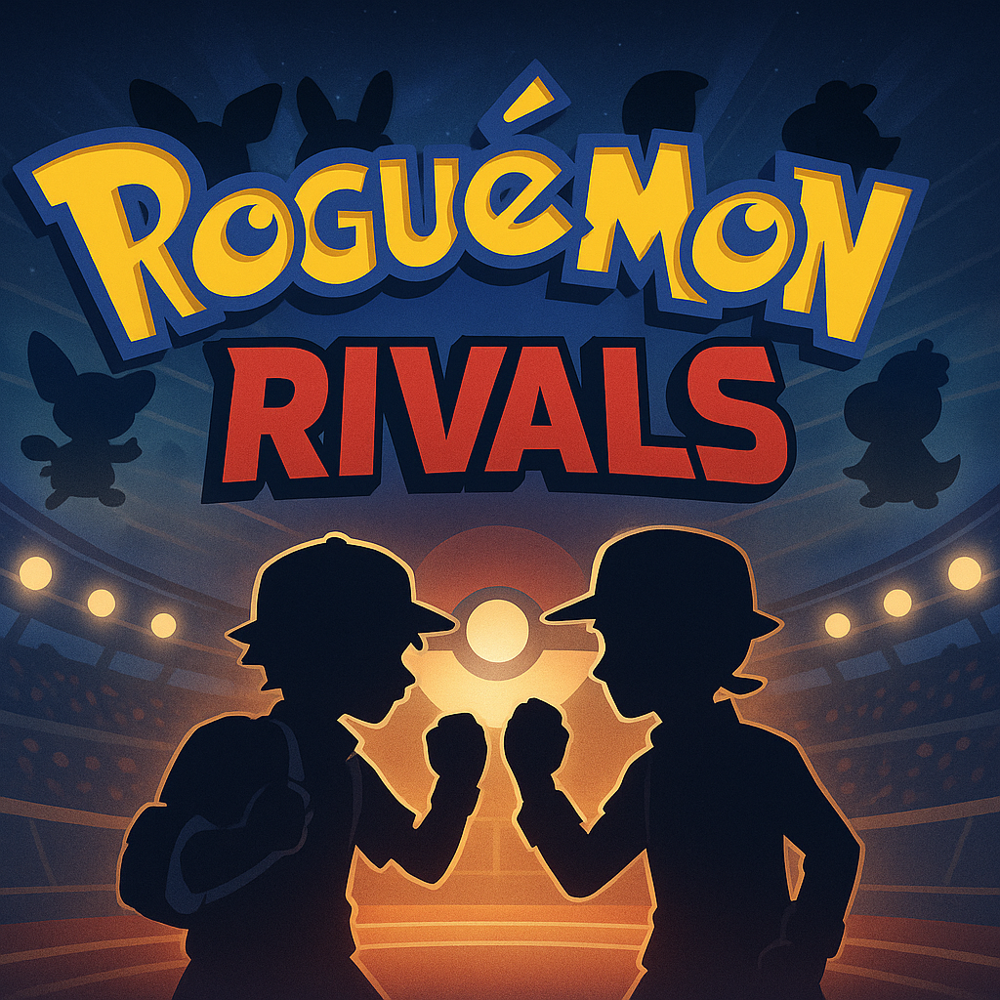

# Roguemon Rivals 🆚

Welcome to **Roguemon Rivals**, a competitive Roguelike Pokémon challenge where two players draft baby Pokémon across all 18 types and battle for supremacy. This format builds off the fan-made **Roguemon** By Crozwords, mod of FireRed/LeafGreen and brings structured 1v1 rivalry with leaderboard scoring, snake-style drafts, and type-based victories.

---

## 🎮 Game Format

### 🧬 Drafting Phase
- **Snake order draft** per type:
  - Player 1 picks 1
  - Player 2 picks 2
  - Player 1 picks 2
  - Player 2 picks 1
- Players draft **3 baby Pokémon** per type (no repeats across types).
- Full draft is recorded in a shared Google Sheet.

📊 **Draft Tracker:**  
[👉 Click here to view the Draft Tracker](https://docs.google.com/spreadsheets/d/1G84KmMYkxTKnaFUwMx1JH2rcPc4vGFONExM2cCNFI4g/edit?usp=sharing)

---

### ⚔️ Challenge Rules

- Each type challenge is done with only the 3 Pokémon drafted for that type.
- Evolutions are allowed via **Roguestones** or in-game triggers.
- If your lead Pokémon faints, the attempt ends.
- Run ends after completing the Elite Four and Champion battle.

---

### 🧮 Scoring & Win Condition

- Each player logs how many **attempts** it took to complete a run for each type.
- The player with **fewer attempts wins that type** and earns **1 point**.
- Ties (same number of attempts) are broken by:
  1. **Fastest real-time run** (if timed)
  2. Or simply ruled a draw (0.5 points each)

✅ First player to win the majority of types (best of 18) wins the **Roguemon Rivals Series**.

---

## 📁 Resources

- 📝 [Draft Template Sheet](https://docs.google.com/spreadsheets/d/1G84KmMYkxTKnaFUwMx1JH2rcPc4vGFONExM2cCNFI4g/edit?usp=sharing)
- 📈 [Scoreboard Template (Make a Copy)](https://docs.google.com/spreadsheets/d/1AbWa4WPAQiyzlvI2I5l_m0M3YqE-ZPL32wDu0jRsoHI/copy)

---

## 🧠 Strategy Tips

- Synergize your team based on evolutions and typings
- Know your cursed segments and prep accordingly
- Don’t underestimate coverage and resistances early

---

## 👾 Credits

Created by: [iCrucialx](https://twitch.tv/icrucialx)  
Co-Created by: [Ceedsy](https://twitch.tv/ceedsy) 

Inspired by: [Roguemon by Crozwords](https://github.com/Crozwords/Roguemon)
